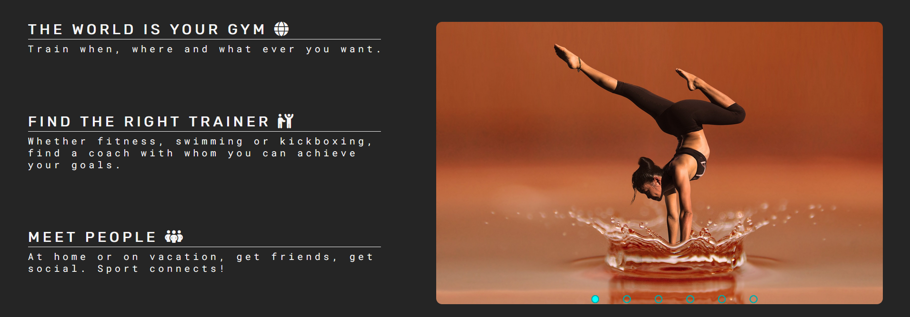
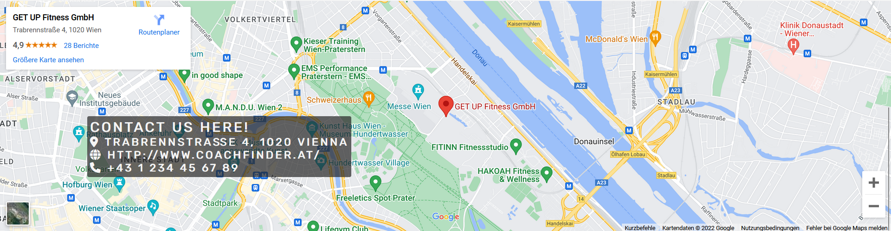
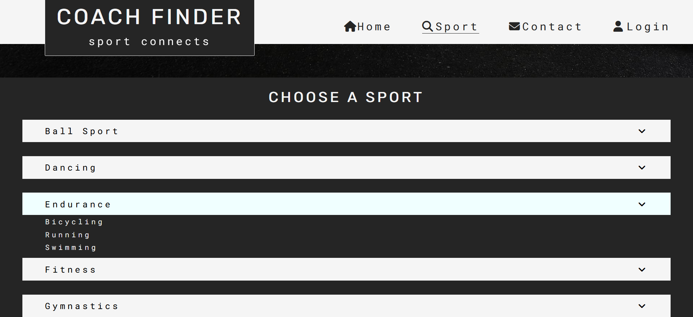
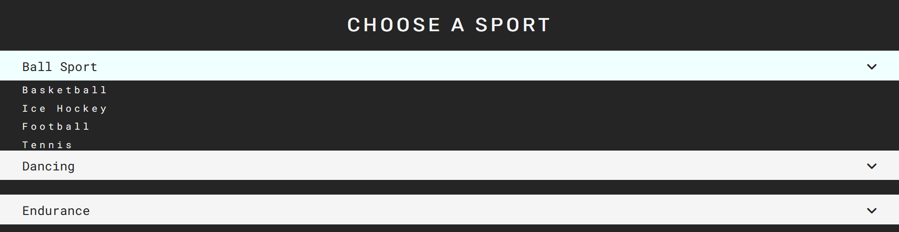
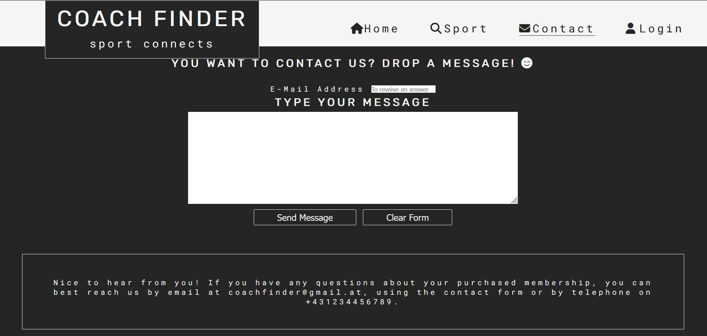

# Coachfinder

Coachfinder is a website that enables people from all over the world to practice their favorite sport. The site is aimed at people with personal sporting interests and coaches who want to pass on their knowledge and promote their careers. In addition, sports providers such as fitness or yoga club operators should also be addressed. 

Screenshot mit different screensices!
den mache ich hier: http://ami.responsivedesign.is/

## Features 

- __Header__

    - The header contains the Coachfinder logo which is a link to the home webpage and the navigation bar.
    - The header has a fixed position and can be seen on all three websites at the top of the browser window.
    - The header tells the user the name of the company and clearly guides the user to all the points that interest them.

- __Navigation Bar__

  - This section allows the user to easily navigate from page to page on all devices without having to use the back button to    go back to the previous page.
  - The fully responsive navigation bar found on all three pages contains links to the home page, sports page and contact page. It also contains a link to the login page, which is not yet working. The website will be expanded in the future. The navigation bar is identical on each page and contains the auto-popping drop-down menu and the sports page link. The sports page is missing this drop-down menu.
  - The drop-down menu contains links to the subcategories of the sports page. These links are not working yet, but will be expanded in the future.
  The dropdown menu appears when the mouse pointer is over the sport button.
  - The basic code of the dropdown menu is taken from the following website, but has been changed a lot.
    - https://www.w3schools.com/howto/howto_css_dropdown.asp

Nav Bar

- __The landing page image__

  - The landing contains a photo with logo overlay. The section is scaled the same on each of the three web pages but contains different images
  - This section aims to motivate the user to use Coachfinder.

Landing Page image

- __The Footer__ 

  - The footer section includes links to the relevant social media sites for Coachfinder. The links will open to a new tab to allow easy navigation for the user. 
  - The footer is the same on all web pages.
  - The footer is valuable to the user as it encourages them to keep connected via social media
  - The footer idea and basic code is taken form the **Code-Institute Love-Running-Project** but has been slightly modified.

Footer

### The Homepage

- __The Slide Show and Slogan section__

#### The Slogan part

  - The Slogan part is located on the left part of the section. It will allow the user to see the benefits of starting with sports and all excuses will be refuted. 
  - This user will see the value of Coachfinder and coaches will see a chance to get clients. 

#### The Slide Show

  - The slide show is in the right part of the section. The images change from right to left. After the last picture, the slide show starts from the beginning. The images change automatically, but can also be changed manually.
  - A few lines of javascript were used for the automatic image shift. The basic code of the slide show is taken from the following website, but has been modified.
    - https://www.youtube.com/watch?v=0wvrlOyGlq0
  - The slide show will convey positive impressions about Coachfinder and motivate the user to use Coachfinder.

Slogan and Slideshow

  - __Map section__

    - In this section the user can see exactly where a coach is available for the desired sport. So the map offers an alternative way to start training or to learn something new. The goal is achieved by clicking on a trainer instead of selecting a sport via the sports page.
    - The View larger map - Link on the left leads to the real **_google maps_** map and the personal Websites of potential coaches.
    - Since the website doesn't actually exist and no coaches are registered, only an example destination in Ireland appears. In the future, however, numerous trainers should be able to be found when scrolling and zooming through the **_google maps_** map. These can then be clicked on, which will take you to their Coachfinder profile. In this profile, the trainers will be able to advertise themselves.
    - This section will be updated as new choaches sign in. 

Map

### The Sport-Page

- __Choose a sport section__

  - The gallersectiony will provide the user with sport categories to choose. 
  - This section is valuable to the user as they will be able to easily find the type of sport they want to train.
  - This section contains a dropdown menu that appears when the user mouses over an item. The elements following below are shifted down. The basic code has a similar structure to the drop-down menu in the header, but has been adapted to current needs.
  - The sports categories lead to specific sports via the drop-down menu. These are links and may be clicked in the future. Numerous coaches and sports clubs will then be displayed on the following web pages. Here the users must then also announce their location in order to narrow down the selection. Since there are many more sports and no real coaches are registered and numerous follow-up web pages would be necessary, the links on this exercise website do not work. 

Sport-Dropdown

Sport-Dropdown-extended 

- __The Map section__

  - Since this section is an alternative to the drop down menu above to find a trainer, the map here is the same as on the home page.

### The Contact-Page

__The Send us a message section__

  - This section will allow the user to send us (***coachfinder-company***) a message with feddback, questions, suggestions, and complaints.
  - to submit the message, the has to type in an e-mail address. 
  - If it were a real website, the only way the company could reply was like that. If the user wants to delete his message or e-mail address, the Clear Form button can be clicked.
  - After sending the message, the user will receive confirmation that the message has arrived and is being processed. Since Coachfinder does not have a real server, the ***Code-Institute*** server was used as an example. Since no nice answer appears here, a *Receive Answer button* has been added. Clicking on this button demonstrates how feedback will look like in the future. If the company ever exists, this button will be deleted.
  - The *Receive Answer button* leads to a **fourth web page (The Response Page)** that can only be reached here. 

Contact

### The Response Page

  - The Response Page contains the same header and footer as the other web pages. Additionally, there is a response section under the header. Here is the message that the request has been received and is being processed.

  Response

### Features Left to Implement

- Planned features: 
    - A sign up/login page leading to a profile page. Here you will be able to set up your profile. This is particularly important for coaches and sports club owners who want to market themselves
    - All specific sports pages that can be selected from the main sports page. Here, as a user, you will select a coach who is nearby and use the link to his profile to find out more about her/him.

## Testing 

In this section, you need to convince the assessor that you have conducted enough testing to legitimately believe that the site works well. Essentially, in this part you will want to go over all of your project’s features and ensure that they all work as intended, with the project providing an easy and straightforward way for the users to achieve their goals.

In addition, you should mention in this section how your project looks and works on different browsers and screen sizes.

You should also mention in this section any interesting bugs or problems you discovered during your testing, even if you haven't addressed them yet.

If this section grows too long, you may want to split it off into a separate file and link to it from here.

### Validator Testing 

- HTML
  - No errors were returned when passing through the official [W3C validator](https://validator.w3.org/nu/?doc=https%3A%2F%2Fcode-institute-org.github.io%2Flove-running-2.0%2Findex.html)
- CSS
  - No errors were found when passing through the official [(Jigsaw) validator](https://jigsaw.w3.org/css-validator/validator?uri=https%3A%2F%2Fvalidator.w3.org%2Fnu%2F%3Fdoc%3Dhttps%253A%252F%252Fcode-institute-org.github.io%252Flove-running-2.0%252Findex.html&profile=css3svg&usermedium=all&warning=1&vextwarning=&lang=en#css)

### Unfixed Bugs

You will need to mention unfixed bugs and why they were not fixed. This section should include shortcomings of the frameworks or technologies used. Although time can be a big variable to consider, paucity of time and difficulty understanding implementation is not a valid reason to leave bugs unfixed. 

## Deployment

This section should describe the process you went through to deploy the project to a hosting platform (e.g. GitHub) 

- The site was deployed to GitHub pages. The steps to deploy are as follows: 
  - In the GitHub repository, navigate to the Settings tab 
  - From the source section drop-down menu, select the Master Branch
  - Once the master branch has been selected, the page will be automatically refreshed with a detailed ribbon display to indicate the successful deployment. 

The live link can be found here - https://code-institute-org.github.io/love-running-2.0/index.html 

## Credits 

In this section you need to reference where you got your content, media and extra help from. It is common practice to use code from other repositories and tutorials, however, it is important to be very specific about these sources to avoid plagiarism. 

You can break the credits section up into Content and Media, depending on what you have included in your project. 

### Content 

- The text for the Home page was taken from Wikipedia Article A
- Instructions on how to implement form validation on the Sign Up page was taken from [Specific YouTube Tutorial](https://www.youtube.com/)
- The icons in the footer were taken from [Font Awesome](https://fontawesome.com/)

### Media

- The photos used on the home and sign up page are from This Open Source site
- The images used for the gallery page were taken from this other open source site

Congratulations on completing your Readme, you have made another big stride in the direction of being a developer! 

## Other General Project Advice

Below you will find a couple of extra tips that may be helpful when completing your project. Remember that each of these projects will become part of your final portfolio so it’s important to allow enough time to showcase your best work! 

- One of the most basic elements of keeping a healthy commit history is with the commit message. When getting started with your project, read through [this article](https://chris.beams.io/posts/git-commit/) by Chris Beams on How to Write  a Git Commit Message 
  - Make sure to keep the messages in the imperative mood 

- When naming the files in your project directory, make sure to consider meaningful naming of files, point to specific names and sections of content.
  - For example, instead of naming an image used ‘image1.png’ consider naming it ‘landing_page_img.png’. This will ensure that there are clear file paths kept. 

- Do some extra research on good and bad coding practices, there are a handful of useful articles to read, consider reviewing the following list when getting started:
  - [Writing Your Best Code](https://learn.shayhowe.com/html-css/writing-your-best-code/)
  - [HTML & CSS Coding Best Practices](https://medium.com/@inceptiondj.info/html-css-coding-best-practice-fadb9870a00f)
  - [Google HTML/CSS Style Guide](https://google.github.io/styleguide/htmlcssguide.html#General)

Getting started with your Portfolio Projects can be daunting, planning your project can make it a lot easier to tackle, take small steps to reach the final outcome and enjoy the process! 
