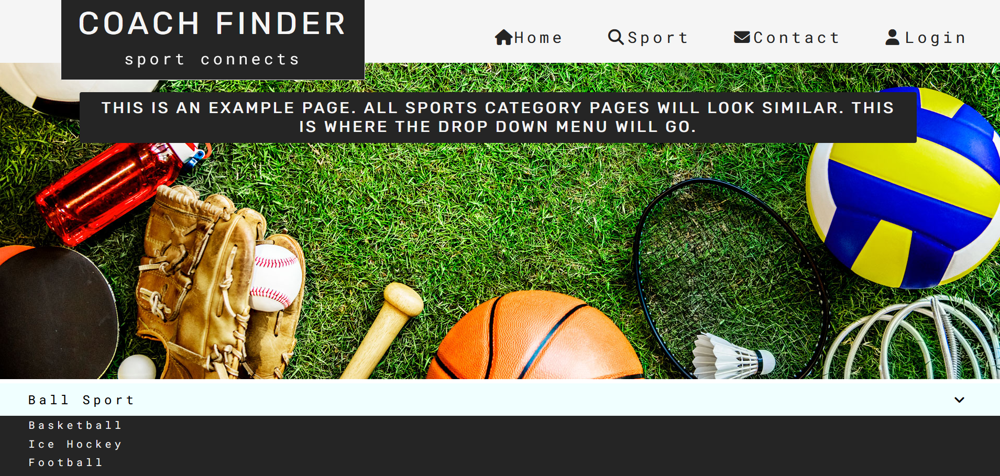
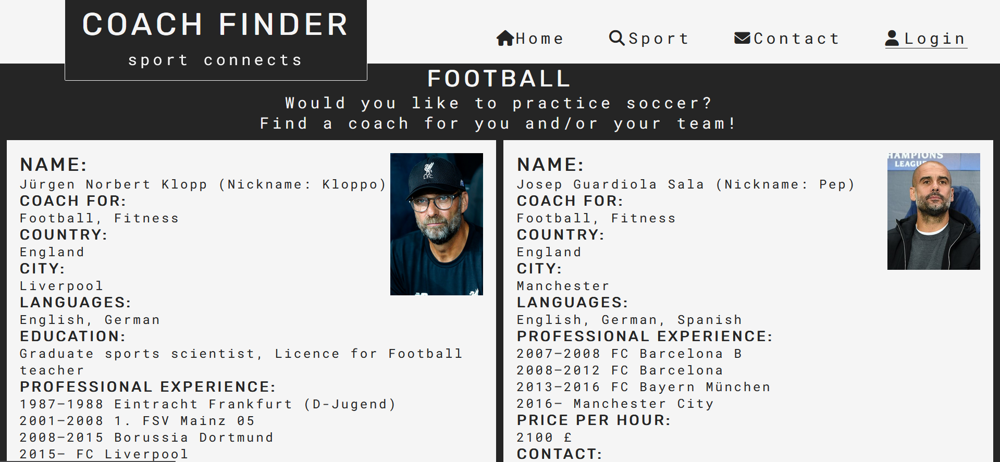
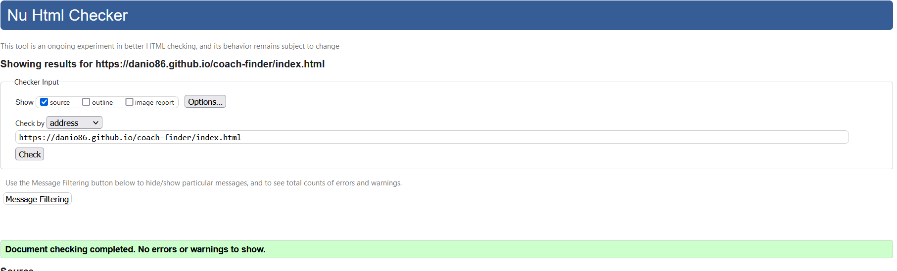
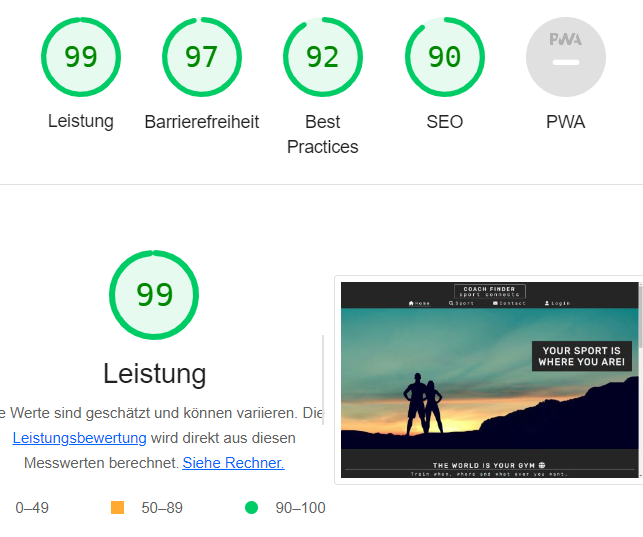

# Coachfinder

Coachfinder is a website that enables people from all over the world to practice their favorite sport. The site is aimed at people with personal sporting interests and coaches who want to pass on their knowledge and promote their careers. In addition, sports providers such as fitness or yoga club operators should also be addressed. 

- Responsice Mockup

## User Stories

- As a visiting user, I can easily understand the main purpose of the website. 
- As a visiting user, I can navigate the website without any problems.
- As a visiting user, I will be able to learn about the company as well as the users.
- As a visiting user, I would like to contact the company founder and other users.

## Features 

- __Header__

    - The header contains the Coachfinder logo which is a link to the home webpage and the navigation bar.
    - The header has a fixed position and can be seen on all three websites at the top of the browser window.
    - The header tells the user the name of the company and clearly guides the user to all the points that interest them.

- __Navigation Bar__

  - This section allows the user to easily navigate from page to page on all devices without having to use the back button to    go back to the previous page.
  - The fully responsive navigation bar found on all three pages contains links to the home page, sports page and contact page. It also contains a link to the login page, which is not yet working. The website will be expanded in the future. The navigation bar is identical on each page and contains the auto-popping drop-down menu and the sports page link.
  - The drop-down menu contains links to the subcategories of the sports page. These links lead to a sports category page. Because there are far too many sports categories and only three pages to create, there is only one sample sports category page in this practice website. The other sports category pages will be created in the future.
  The dropdown menu appears when the mouse pointer is over the sport button.
  - The basic code of the dropdown menu is taken from the following website, but has been changed a lot.
    - [w3schools](https://www.w3schools.com/howto/howto_css_dropdown.asp)
  - Up to a screen size of 750px the dropdown menu appears as a clickable burger button menu.
  - The basic code of the clickable burger button menu is taken from the following website, but has been changed a lot.
    - [Álvaro Trigo](https://alvarotrigo.com/blog/hamburger-menu-css/)

  - Nav Bar Images:
    - Nav Bar
    
    

    - Hamburger Menu

    
    

- __The landing page image__

  - The landing contains a photo with logo overlay. The section is scaled the same on each of the three web pages but contains different images
  - The landing page title is inside the landing image.
  - This section aims to motivate the user to use Coachfinder.

  - Landing Page image

  

- __The Footer__ 

  - The footer section includes links to the relevant social media sites for Coachfinder. The links will open to a new tab to allow easy navigation for the user. 
  - The footer is the same on all web pages.
  - The footer is valuable to the user as it encourages them to keep connected via social media
  - The footer idea and basic code is taken form the **Code-Institute Love-Running-Project** but has been slightly modified.

  - Footer
  

### The Homepage

- __The Slide Show and Slogan section__

#### The Slogan part

  - The Slogan part is located on the left part of the section. It will allow the user to see the benefits of starting with sports and all excuses will be refuted. 
  - This user will see the value of Coachfinder and coaches will see a chance to get clients. 

#### The Slide Show

  - The slide show is in the right part of the section. The images change from right to left. After the last picture, the slide show starts from the beginning. The images change automatically, but can also be changed manually.
  - A few lines of javascript were used for the automatic image shift. The basic code of the slide show is taken from the following website, but has been modified.
    - [Specific YouTube Tutorial](https://www.youtube.com/watch?v=0wvrlOyGlq0)
  - The slide show will convey positive impressions about Coachfinder and motivate the user to use Coachfinder.

- Slogan and Slideshow

  #### The Map section

    - In this section the user can see exactly where a coach is available for the desired sport. So the map offers an alternative way to start training or to learn something new. The goal is achieved by clicking on a trainer instead of selecting a sport via the sports page.
    - The View larger map - Link on the left leads to the real **_google maps_** map and the personal Websites of potential coaches.
    - Since the website doesn't actually exist and no coaches are registered, only an example destination in Ireland appears. In the future, however, numerous trainers should be able to be found when scrolling and zooming through the **_google maps_** map. These can then be clicked on, which will take you to their Coachfinder profile. In this profile, the trainers will be able to advertise themselves.
    - This section will be updated as new choaches sign in. 

    - Map
    

### The Sport-Page

- __Choose a sport section__

  - The gallersectiony will provide the user with sport categories to choose. 
  - This section is valuable to the user as they will be able to easily find the type of sport they want to train.
  - This section contains a dropdown menu that appears when the user mouses over an item. The elements following below are shifted down. The basic code has a similar structure to the drop-down menu in the header, but has been adapted to current needs.
  - The sports categories lead to specific sports via the drop-down menu. These are links and may be clicked in the future. Numerous coaches and sports clubs will then be displayed on the following web pages. Here the users must then also announce their location in order to narrow down the selection. Since there are many more sports and no real coaches are registered and numerous follow-up web pages would be necessary, the links lead to a specific sport example page. Because there are far too many sports and only three pages to create, there is only one sample page in this practice website. The other specific sport pages will be created in the future. 

  - Sport-Dropdown
  
  - Sport-Dropdown-extended 
  

- __The Map section__

  - Since this section is an alternative to the drop down menu above to find a trainer, the map here is the same as on the home page.

### The Contact-Page

__The Send us a message section__

  - This section will allow the user to send us (***coachfinder-company***) a message with feddback, questions, suggestions, and complaints.
  - to submit the message, the has to type in an e-mail address. 
  - If it were a real website, the only way the company could reply was like that. If the user wants to delete his message or e-mail address, the Clear Form button can be clicked.
  - After sending the message, the user will receive confirmation that the message has arrived and is being processed. Since Coachfinder does not have a real server, the ***Code-Institute*** server was used as an example. Since no nice answer appears here, a *Receive Answer button* has been added. Clicking on this button demonstrates how feedback will look like in the future. If the company ever exists, this button will be deleted.
  - The *Receive Answer button* leads to a **fourth web page (The Response Page)** that can only be reached here. 

  - Contact
  

### The Response Page

  - The Response Page contains the same header and footer as the other web pages. Additionally, there is a response section under the header. Here is the message that the request has been received and is being processed.

  - Response
  

### The Login Page

  - This page will allow the user to log in to coachfinder. If the user has not yet registered, he can do so here. No user can log in without having registered. After klicking the sign up button oder the login butten, without beeing registered, the user comes to the signup page.

  - Login
  

### The Sign Up Pages

  - There are two Sign Up pages with different headings. To the first one the user comes by clicking the Sign Up button, to the other page the user comes by trying to log in without being registered first. Other than that, both sides are the same. The user can register here. All fields are mandatory.
  - A few lines of javascript were used for the repeat-password field. The basic code for this is taken from the following website.
    - [Codepen](https://codepen.io/diegoleme/pen/qBpyvr)

  - Sign Up
  

  - Sign Up-Mistake
  

### The Thank You Page

  - The Thank You (thx) page contains a landing image with a message inside. In it, the company Coachfinder thanks the user for registering it. In the future, the user will now receive an email in which he must click a confirmation link. This will lead him to a Coachfinder profile page. In the future he can then set up his profile. This page will be created in the future.

  - Thank You
  

### The Sport Category Page

  - The Sport Category page contains a landing image and a dropdown menu below. It is the same dropdown menu like the spors page. But only the sport category that the user clicked appears. Because there are far too many sports categories and only three pages to create, there is only one sample sports category page in this practice website. The other sports category pages will be created in the future.
  - The dropdown menu contains links to a specific sport page. Because there are far too many sports and only three pages to create, there is only one sample page in this practice website. The other specific sport pages will be created in the future.

  - Sport Category
  

### The Specific Sport Page 

  - The Specific Sport Page contains a list of coaches to choose. 
  - Here the user finds all the information he needs to decide on a trainer. This coach can then be contacted directly.
  - In the future you will find here a selection selected by location. The location is taken from the profile but can be changed here temporarily (travel situation). There will also be the option of contacting the coach via a chat function.

  - Specific Sport
  

### Features Left to Implement

  - Planned features: 
    - A Profile page. Here you will be able to set up your profile. This is particularly important for coaches and sports club owners who want to market themselves. 
    - All sport category and all specific sports pages that can be selected from the main sports page. Here, as a user, you will select a coach who is nearby and use the link to further information about her/him.
    - A chat function will be added to the specific sport page to contact the coach directly.
    - A location selector will be added to the specific sport page.
    - The map will show many destinations leading to the coaches' profiles.

## Testing 

- I have tested that the website works in different browsers (Chrome and Firefox).
- I confirm that the website works and looks good on all standard screen sizes. This was tested with the devtools divice toolbar.
- I certify that the header, navigation, sport, contact and response text is easy to read and understand.
- I confirm that the form in the contact page is working. An e-mail address must be entered in order to receive a reply.

### Validator Testing

  - HTML
      - No errors were returned when passing through the official W3C validator.
      - All web pages have been tested.

  - CSS
      - No errors were found when passing through the official (Jigsaw) validator.

  - Accessibility
      - I confirm that the colors and fonts selected are easy to read and accessible. This was discovered using lighthouse in devtools.
      - All web pages have been tested for desktop and mobil devices.

- HTML Validation

- CSS Validation

- JavaScipt Validation

- Lighthouse-Desktop

- Lighthouse-Mobil

### Unfixed Bugs

No Bugs are unfixed.

## Deployment

- The site was deployed to GitHub pages. The steps to deploy are as follows: 
  - In the GitHub repository, navigate to the Settings tab 
  - In menu on the left side, select pages
  - Scrool down to Branch and select main
  - push the Save button
  - Once the master branch has been selected, the page will be automatically refreshed with a detailed ribbon display to indicate the successful deployment. 

The live link can be found [here](https://danio86.github.io/coach-finder/index.html)

## Credits 

In this section you need to reference where you got your content, media and extra help from. It is common practice to use code from other repositories and tutorials, however, it is important to be very specific about these sources to avoid plagiarism. 

You can break the credits section up into Content and Media, depending on what you have included in your project. 

### Content

- Instructions on how to implement form validation on the Login, Sign Up and Sign Up Mistake page was taken from [Code Institute - Love Running Project](https://learn.codeinstitute.net/courses/course-v1:CodeInstitute+LR101+2021_T1/courseware/4a07c57382724cfda5834497317f24d5/4d85cd1a2c57485abbd8ccec8c00732c/)
- All icons were taken from [Font Awesome](https://fontawesome.com/)
- Font styles were taken from [Google Fonts](https://fonts.googleapis.com)
- The basic code of the header dropdown menu is taken from the following website, but has been changed. [w3schools](https://www.w3schools.com/howto/howto_css_dropdown.asp)
- The basic code of the clickable burger button menu is taken from the following website, but has been changed. [Álvaro Trigo](https://alvarotrigo.com/blog/hamburger-menu-css/)
- The basic code of the slide show is taken from the following website, but has been modified. [Specific YouTube Tutorial](https://www.youtube.com/watch?v=0wvrlOyGlq0)
- Instructions on how to implement a google map into a website was taken from [Code Institute - Coders Coffeehouse Project](https://learn.codeinstitute.net/courses/course-v1:CodeInstitute+HE101+2020/courseware/fcc67a894619420399970ae84fc4802f/13db720675f94dbca6b0fe79467628ca/)
- Instructions on how to implement links into the footer was taken from [Code Institute - Love Running Project](https://learn.codeinstitute.net/courses/course-v1:CodeInstitute+LR101+2021_T1/courseware/4a07c57382724cfda5834497317f24d5/e6d4cda2bc08458ba94d2092be9bad3a/)
- Instructions on how to implement Textblocks into Images or maps was taken from [Code Institute - Coders Coffeehouse Project](https://learn.codeinstitute.net/courses/course-v1:CodeInstitute+HE101+2020/courseware/fcc67a894619420399970ae84fc4802f/13db720675f94dbca6b0fe79467628ca/)
- Instructions on how to center content vertically and horizontally was taken from [w3schools](https://www.w3schools.com/howto/howto_css_center-vertical.asp)
- The code for the password	confirmation is taken from [Codepen](https://codepen.io/diegoleme/pen/qBpyvr)

### Media

- The Images used on all pages, except the sport-category page and trainer photos on the specific-sport page are from this Open Source site [Pixabay](https://pixabay.com/de/)
- The photos used for the coaches on the specific-sport page were taken from [Wikipedia](https://de.wikipedia.org/wiki/Wikipedia:Hauptseite). The authors must be specified in each case.
  - [Jürgen Klopp: Von Fars Media Corporation, CC-BY 4.0,](https://commons.wikimedia.org/w/index.php?curid=81344322)
  - [Pep Guardiola: Von Football.ua, CC BY-SA 3.0,](https://commons.wikimedia.org/w/index.php?curid=71584908)
  - [Steffi Jones: Von © Raimond Spekking / CC BY-SA 4.0 (via Wikimedia Commons), CC BY-SA 4.0,](https://commons.wikimedia.org/w/index.php?curid=25424821)
  - [José Mourinho: Von Дмитрий Голубович - https://www.soccer0010.com/galery/1013397/photo/673146, CC BY-SA 3.0,](https://commons.wikimedia.org/w/index.php?curid=62794666)
  - [Zinédine Zidane: Von Tasnim News Agency, CC-BY 4.0,](https://commons.wikimedia.org/w/index.php?curid=64815490)
  - [Hansi Flick: Von Steffen Prößdorf, CC BY-SA 4.0,](https://commons.wikimedia.org/w/index.php?curid=121296260)

### Personal Advice

  - Thank You!
    -  Jubril Akolade
    - All people from my Slack Group!